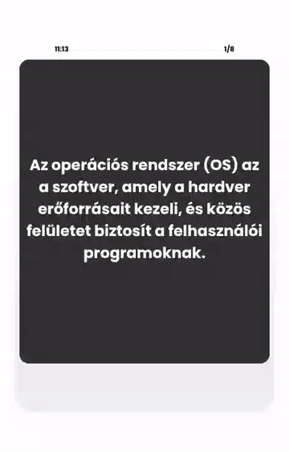
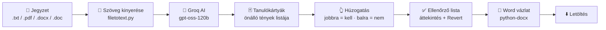
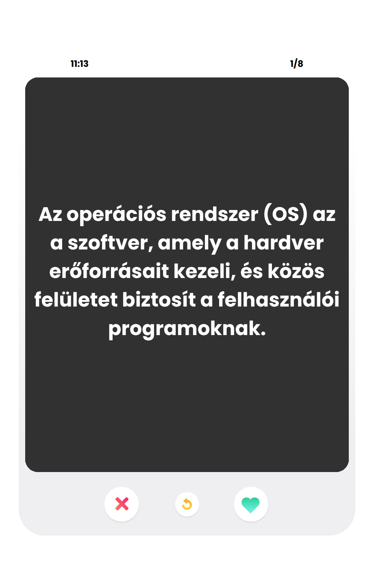
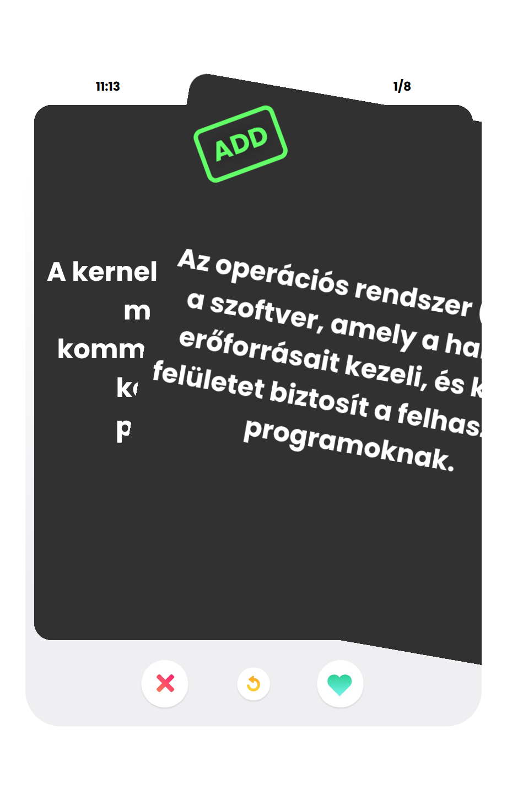
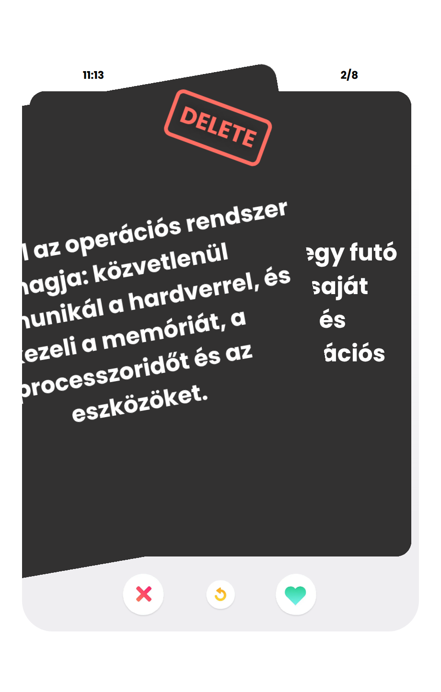
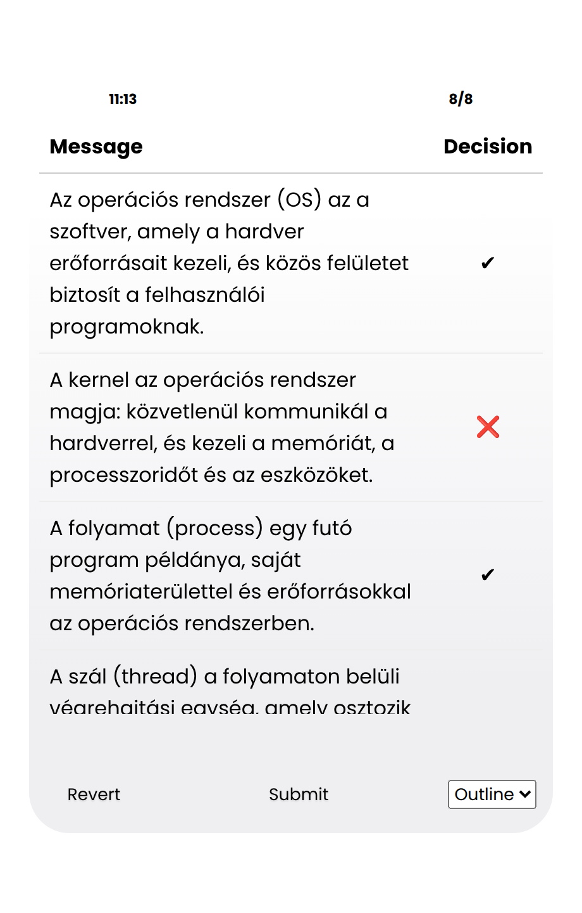
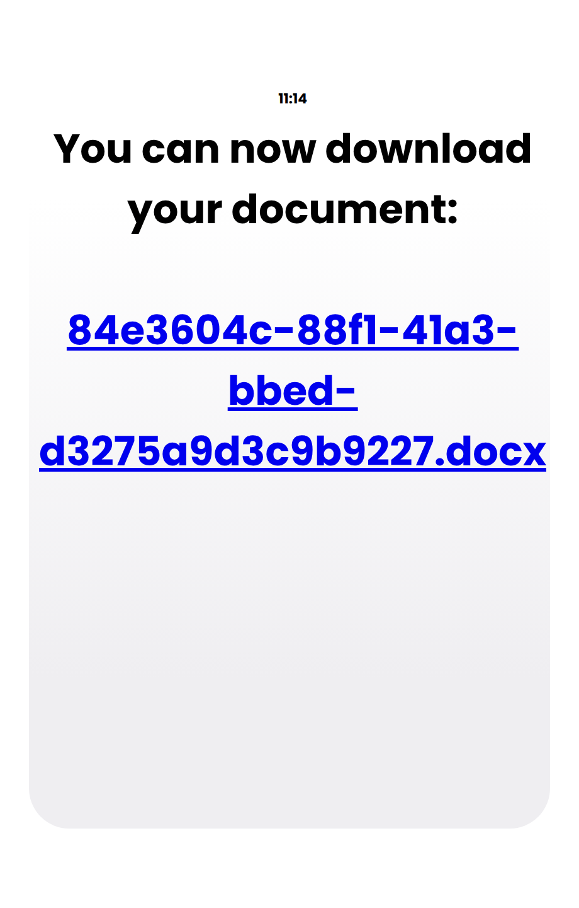
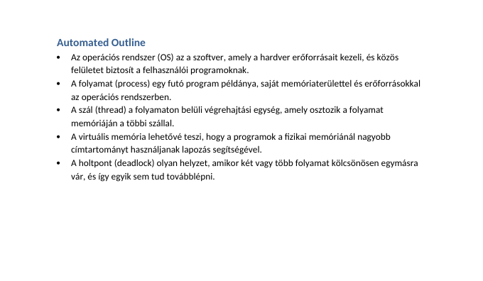

<div align="center">

# 📚 StudySwap

### Húzd jobbra, ami kell. Húzd balra, ami nem.
**Egy Tinder-stílusú tanulóalkalmazás, ami a jegyzetedből AI segítségével önálló tanulókártyákat csinál, te pedig kiválogatod belőlük a lényeget – a végén letölthető Word-vázlatot kapsz.**

<br>


<br>



<sub>Élő demó – a videó teljes minőségben: <a href="docs/assets/demo.mp4">docs/assets/demo.mp4</a></sub>

</div>

---

## 📑 Tartalom

1. [Mi ez és mire jó?](#-mi-ez-és-mire-jó)
2. [Így működik](#-így-működik)
3. [Képek a platformról](#-képek-a-platformról)
4. [Funkciók](#-funkciók)
5. [Backend és API-k](#-backend-és-api-k)
6. [Telepítés lépésről lépésre](#-telepítés-lépésről-lépésre)
7. [Beállítások és karbantartás](#-beállítások-és-karbantartás)
8. [Projektstruktúra](#-projektstruktúra)
9. [Hibaelhárítás](#-hibaelhárítás)
10. [Ismert korlátok](#-ismert-korlátok)

---

## 💡 Mi ez és mire jó?

Ismerős a helyzet: van egy 40 oldalas jegyzeted vagy PDF-ed vizsgára, tele félmondatokkal, felsorolásokkal, „lásd fent" utalásokkal. Ezekből nehéz tanulni, mert egy-egy sor **önmagában nem érthető**.

A **StudySwap** ezt oldja meg:

| Probléma | Megoldás a StudySwap-ban |
|---|---|
| A jegyzet töredékes, egymásra hivatkozó mondatokból áll | Az AI **önálló, 1–2 mondatos tényekké** írja át (névmások, „ezek a rétegek" jellegű utalások helyett konkrét fogalmakkal) |
| Nem minden fontos a vizsgához | **Te döntesz**: minden kártyánál jobbra (megtartom) vagy balra (kidobom) húzol |
| A végén kellene egy használható tanulóanyag | A kiválasztott tényekből **automatikusan Word (.docx) vázlat** készül |

### Kinek hasznos?

- 🎓 **Egyetemistáknak, középiskolásoknak** – vizsgaidőszakban, hosszú jegyzetek/prezentációk tömörítéséhez.
- 🧑‍🏫 **Oktatóknak** – egy tananyagból gyorsan készíthető kiemelt vázlat vagy ellenőrző pontlista.
- 🗣️ **Nyelvtanulóknak** – az AI **a bemenettel azonos nyelven** válaszol, tehát magyar jegyzetből magyar kártya lesz.
- 🧠 **Aki aktívan tanul** – a húzogatás közben kénytelen vagy átgondolni, mi fontos, ez maga is tanulás.

> A „swipe" mozdulat szándékosan játékos: a szűrés unalmas munkából pár perces, gyors kör lesz.

---

## 🔄 Így működik



1. A `main.py`-ban megadod a jegyzeted elérési útját.
2. Az alkalmazás kinyeri a szöveget, elküldi a Groq AI-nak, és **helyben gyorsítótárazza** a választ (nem fizetsz/hívsz kétszer ugyanarra).
3. A böngésző automatikusan megnyílik a kártyákkal.
4. Végighúzod a kártyákat, ellenőrzöd a döntéseidet, majd **Submit**.
5. Letöltöd az elkészült `.docx` fájlt.

---

## 🖼️ Képek a platformról

<div align="center">

| 1. Kártyák betöltve | 2. Jobbra húzás → **ADD** | 3. Balra húzás → **DELETE** |
|:---:|:---:|:---:|
|  |  |  |

| 4. Döntések ellenőrzése | 5. Letöltés | 6. Az elkészült Word-vázlat |
|:---:|:---:|:---:|
|  |  |  |

</div>

🎬 **Videó:** [docs/assets/demo.mp4](docs/assets/demo.mp4) – a teljes folyamat a betöltéstől a letöltésig.

> A képek egy rövid, saját példajegyzetből (operációs rendszerek) készültek.

---

## ✨ Funkciók

### 🃏 Kártyák és húzogatás
- **Egérrel és érintőképernyőn is** működik (húzás / swipe).
- A kártya húzás közben **elforog**, és megjelenik a felirat: zöld **ADD** (jobbra) vagy piros **DELETE** (balra).
- **80 px** húzás után dől el a döntés; ha kevesebbet húzol, a kártya visszaugrik.
- Alul gombok is vannak: ❌ elvet, ❤️ megtart, ↺ visszavonás.
- Fent **óra** és **számláló** (pl. `3/8`) mutatja, hol tartasz.

### ↩️ Visszavonás és ellenőrzés
- **Undo (↺):** az utolsó döntés visszavonható, akár többször is.
- Az utolsó kártya után megjelenik az **ellenőrző táblázat**: minden tény mellett ✔ (megtartva) vagy ❌ (elvetve).
- **Revert:** visszalépés a kártyákhoz, ha mégis változtatnál.

### 🤖 AI-feldolgozás
- Bemenet: **`.txt`, `.pdf`, `.docx`, `.doc`**.
- Az AI a jegyzetet **önálló tényekké** alakítja:
  - névmások és utalások helyett konkrét fogalmak,
  - töredékek („Cél:") teljes definícióvá bővítve,
  - minden tény a többitől függetlenül is érthető.
- A válasz nyelve = a jegyzet nyelve.

### 💾 Gyorsítótár
- Az AI válasza fájlonként el van mentve, ezért **ugyanazt a jegyzetet újranyitva nincs új API-hívás**.
- Törlés: `python clear_caches.py`.

### 📝 Exportálás
- A megtartott tényekből **Word-vázlat („Automated Outline")** készül, felsorolásjeles listával, Calibri 12 pt betűvel.
- Egyedi, nehezen kitalálható fájlnév (UUID + időbélyeg részlet) – nem írják felül egymást.

---

## ⚙️ Backend és API-k

A backend **Python + Flask**. Külső szolgáltatásként csak a **[Groq](https://groq.com)** API-t használja.

### Végpontok

| Metódus | Útvonal | Mit csinál |
|:---:|---|---|
| `GET` | `/` | Tájékoztató oldal: a fájl helyét a `main.py`-ban kell megadni. |
| `GET` | `/cards?path=<fájl>` | Beolvassa a fájlt, (szükség esetén) meghívja az AI-t, majd kirajzolja a kártyás felületet. |
| `POST` | `/submit-texts` | Fogadja a megtartott tényeket, legenerálja a `.docx`-et, és visszaadja a letöltési útvonalat. |
| `GET` | `/download/<filename>` | Letöltő oldal az elkészült fájllal. |
| `GET` | `/static/files/<token>.docx` | Maga a generált dokumentum. |

### `POST /submit-texts`

**Kérés (JSON):**

```json
{
  "token": "84e3604c-88f1-41a3-bbed-d3275a9d3c9b9227",
  "texts": [
    { "textId": 1, "text": "Az operációs rendszer (OS) az a szoftver, amely..." },
    { "textId": 3, "text": "A folyamat (process) egy futó program példánya..." }
  ],
  "doctype": "outline"
}
```

**Válasz:**

```json
{ "redirect": "/download/84e3604c-88f1-41a3-bbed-d3275a9d3c9b9227.docx" }
```

Hibás JSON esetén: `400` és `{"error": "Invalid JSON"}`.

### Az AI-hívás (`src/callgroq.py`)

| Beállítás | Érték |
|---|---|
| Szolgáltató | Groq (`groq` Python csomag) |
| Modell | `openai/gpt-oss-120b` |
| Válasz formátuma | Python-lista sztringekből: `['tény1', 'tény2', ...]` |
| Max. kimeneti token | `8192` |
| Reasoning | `medium` |

A válasz biztonságosan van feldolgozva (`ast.literal_eval`, nem `eval`). Ha az AI hibás formátumot ad, üres lista lesz belőle, nem omlik össze az oldal.

### Fájlfeldolgozás (`src/filetotext.py`)

| Kiterjesztés | Módszer |
|---|---|
| `.txt` | egyszerű olvasás (UTF-8) |
| `.pdf` | `PyPDF2`, oldalanként |
| `.docx` | `python-docx`, bekezdésenként |
| `.doc` | `textract` (opcionális, külön telepítendő) |

### Frontend
Külön keretrendszer nélkül: **Jinja2 sablonok + vanilla JavaScript + jQuery** (a POST kéréshez) és saját CSS. A húzás mouse/touch eseményekkel van megvalósítva.

---

## 🚀 Telepítés lépésről lépésre

### Követelmények

| Mit | Miért |
|---|---|
| **Python 3.10 vagy újabb** | az alkalmazás futtatásához |
| **Groq API-kulcs** (ingyenesen igényelhető) | az AI-hoz – **enélkül nem fog működni** |
| **Internetkapcsolat** | Groq API + jQuery CDN |
| Modern böngésző (Chrome, Edge, Firefox, Safari) | a felülethez |

### 1️⃣ Projekt letöltése

```bash
git clone <repo-url>
cd studyswap
```

*(Vagy töltsd le a ZIP-et, csomagold ki, és lépj be a mappába.)*

### 2️⃣ Virtuális környezet és csomagok

```bash
python -m venv venv

# Windows:
venv\Scripts\activate
# macOS / Linux:
source venv/bin/activate

pip install -r requirements.txt
```

### 3️⃣ ⚠️ A `.env` fájl kitöltése – KÖTELEZŐ

> **Ha ezt kihagyod, az alkalmazás nem fog működni** – az AI-hívás API-kulcs nélkül hibával leáll.

1. Regisztrálj / lépj be: **<https://console.groq.com>**
2. Menj az **API Keys** oldalra, és készíts egy új kulcsot.
3. A projekt gyökerében hozz létre egy **`.env`** nevű fájlt (a `.env.example` átmásolásával), és írd bele:

```env
GROQ_API_KEY=gsk_ide_masold_a_sajat_kulcsodat
```

Szabályok:
- nincs szóköz az `=` körül, nincsenek idézőjelek,
- a fájl neve pontosan `.env` (nem `.env.txt`),
- a fájl a `main.py` mellett legyen.

> 🔐 **Biztonság:** a kulcsod titok. **Ne töltsd fel GitHubra**, és ne oszd meg. A mellékelt `.gitignore` kizárja a `.env`-et. Ha egy kulcs korábban véletlenül nyilvánossá vált (pl. egy megosztott ZIP-ben), a Groq konzolban **töröld, és generálj újat**.

### 4️⃣ Szükséges mappák létrehozása

Az alkalmazás ide menti a gyorsítótárat és a kész dokumentumokat. Ha ezek nincsenek meg, hibát kapsz:

```bash
# Windows (PowerShell):
mkdir static\caches, static\files

# macOS / Linux:
mkdir -p static/caches static/files
```

### 5️⃣ A jegyzeted megadása

Nyisd meg a **`main.py`**-t, és írd be a fájl teljes elérési útját:

```python
file_to_open = r"C:\Users\Nev\Documents\jegyzet.pdf"     # Windows
# file_to_open = r"/home/nev/jegyzet.docx"                # macOS / Linux
```

Támogatott: `.txt`, `.pdf`, `.docx`, `.doc`. Ha üresen hagyod vagy elírod, ezt kapod: *„Please provide a valid file path to your project!"*

### 6️⃣ Indítás

```bash
python main.py
```

A böngésző ~1 másodperc múlva **magától megnyílik** a kártyákkal. Az első futásnál az AI-feldolgozás pár másodpercet (hosszú anyagnál akár többet) igénybe vehet; utána a gyorsítótárból azonnal betölt.

> ⚠️ **80-as port:** az alkalmazás a `80`-as porton fut. Linuxon/macOS-en ehhez rendszergazdai jog kell (`sudo python main.py`), vagy állítsd át a portot a `main.py` végén (`app.run(port=5000)`) – ekkor a `open_browser()` függvényben lévő URL-t is írd át `http://localhost:5000/...`-ra.

---

## 🛠️ Beállítások és karbantartás

| Mit | Hol | Leírás |
|---|---|---|
| Gyorsítótár ki/be | `app_init.py` → `cache_is_on` | `True`: az AI válasza mentődik és újrahasználódik. `False`: minden indításkor új AI-hívás. |
| AI modell, prompt | `src/callgroq.py` | Itt módosíthatod a modellt, a hőmérsékletet és a kártyák írásának szabályait. |
| Gyorsítótár törlése | `python clear_caches.py` | Törli a mentett AI-válaszokat (pl. ha jobb kártyákat szeretnél ugyanabból a jegyzetből). |
| Port | `main.py` → `app.run(port=...)` | Alapértelmezett: 80. |

---

## 🗂️ Projektstruktúra

```text
studyswap/
├── main.py                 # Belépési pont: fájl megadása, szerver + böngésző indítása
├── app_init.py             # Flask app és beállítások (cache_is_on stb.)
├── clear_caches.py         # Gyorsítótár törlése
├── requirements.txt        # Python csomagok
├── .env                    # 🔑 GROQ_API_KEY (te hozod létre, nem kerül verziókezelésbe)
├── src/
│   ├── routes.py           # Flask végpontok
│   ├── callgroq.py         # Groq AI hívás + válasz feldolgozás
│   ├── filetotext.py       # txt / pdf / docx / doc → szöveg
│   └── functions.py        # Word-dokumentum generálás, token
├── templates/
│   ├── index.html          # Kártyás felület + húzás logika
│   └── download.html       # Letöltő oldal
├── static/
│   ├── style.css           # Design
│   ├── js_you_dont_mind.js # Óra a fejlécben
│   ├── caches/             # AI-válaszok (automatikusan töltődik)
│   └── files/              # Elkészült .docx fájlok
└── docs/assets/            # README képek és videó
```

---

## 🩺 Hibaelhárítás

| Tünet | Ok és megoldás |
|---|---|
| `Please provide a valid file path…` | A `main.py`-ban a `file_to_open` üres vagy rossz útvonalra mutat. |
| `groq.AuthenticationError` / 401 | Hiányzik vagy hibás a `GROQ_API_KEY` a `.env`-ben. Ellenőrizd az elírást, a szóközöket, és hogy a `.env` a `main.py` mellett van. |
| `The api_key client option must be set…` | A `.env` nem töltődött be – rossz a fájlnév vagy a hely. |
| `PermissionError` / nem indul a 80-as porton | Indítsd rendszergazdaként (`sudo`), vagy válts portot (lásd fent). |
| `FileNotFoundError: static/caches/…` vagy `static/files/…` | Nincsenek létrehozva a mappák – lásd a 4. lépést. |
| A kártyák üresek / „There are no more people near you" | Az AI hibás formátumú választ adott (üres lista lett). Töröld a gyorsítótárat (`python clear_caches.py`), és próbáld újra, vagy rövidebb anyaggal. |
| A Submit gombnak nincs hatása | A jQuery CDN-ről töltődik – ellenőrizd az internetkapcsolatot. |
| `.doc` fájl nem olvasható | Telepítsd a `textract` csomagot, vagy mentsd el a fájlt `.docx`-ként. |

---

## ⚠️ Ismert korlátok

Őszintén, hogy ne érjen meglepetés:

- **Helyi, egyfelhasználós eszköz.** Nincs bejelentkezés, feltöltés a böngészőből, vagy adatbázis – a fájlt a `main.py`-ban kell megadni.
- **Hosszú anyagoknál** az AI válasza a `8192` tokenes kimeneti limit miatt csonkulhat; ilyenkor érdemes az anyagot részekre bontani.
- **A jegyzet tartalma a Groq szolgáltatáshoz kerül** feldolgozásra – ne használj bizalmas anyagot.
- Jelenleg **egy kimeneti típus** van (`outline`); a „long" változat előkészítve, de még nincs bekapcsolva.
- Az AI hibázhat: **a kártyákat érdemes átfutni**, mielőtt tanulsz belőlük – ezért is van a húzogatás.

---

<div align="center">

**Jó tanulást! 🎓**

<sub>Készült Flask, Groq és sok kávé segítségével.</sub>

</div>
